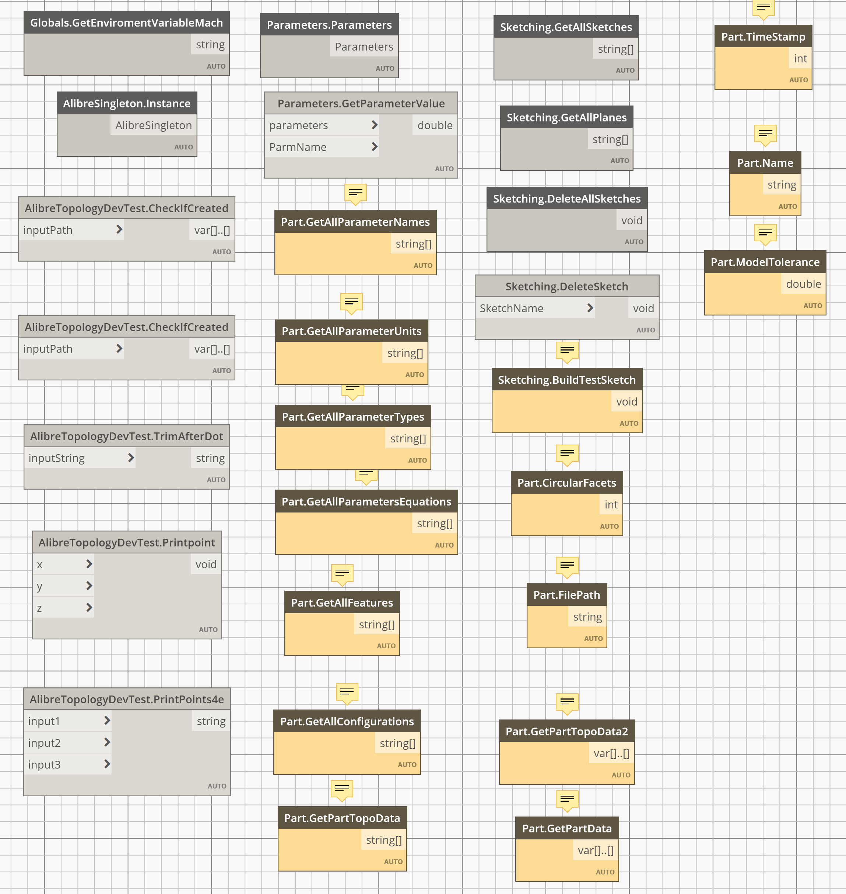

Dynamo nodes for Alibre Design.

---
## Node Categories

### Global Environment and Session
- Globals.GetEnvironmentVariableMach
- AlibreSingleton.Instance

---
### Parameters & Metadata
- Parameters.Parameters
- Parameters.GetParameterValue
- Part.GetAllParameterNames
- Part.GetAllParameterUnits
- Part.GetAllParameterTypes
- Part.GetAllParametersEquations
- Part.Name
- Part.TimeStamp
- Part.ModelTolerance

---
### Sketching
- Sketching.GetAllSketches
- Sketching.GetAllPlanes
- Sketching.DeleteAllSketches
- Sketching.DeleteSketch
- Sketching.BuildTestSketch

---
### Feature & Geometry Extraction
- Part.GetAllFeatures
- Part.CircularFacets

---
### File and Configuration Data
- Part.FilePath
- Part.GetAllConfigurations
- Part.GetPartTopoData
- Part.GetPartTopoData2
- Part.GetPartData

---
### Custom Test & Debug Utilities
- AlibreTopologyDevTest.CheckIfCreated
- AlibreTopologyDevTest.TrimAfterDot
- AlibreTopologyDevTest.PrintPoint
- AlibreTopologyDevTest.PrintPoints4e

---
## Example Use Cases
- Design data inspection and exporting
- Configuration editing
- Parameter editing
- Create and delete sketches
- Create and delete features
- Access and visualize part data for other workflows and tools

---
## Installation

TBD
